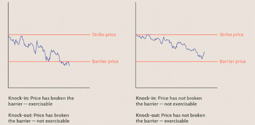
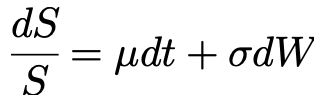
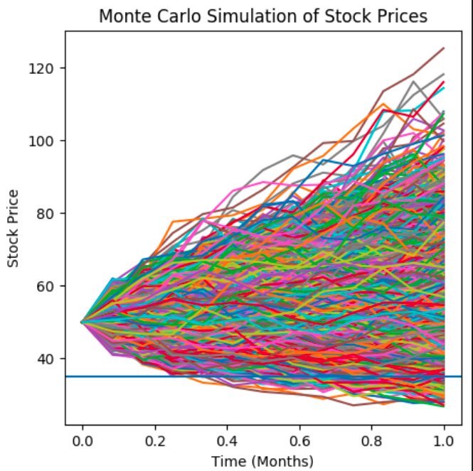

# JPMC QUANT CHALLENGE

## Barrier Option Pricing Model
A barrier option is a type of derivative where the payoff depends on whether or not the underlying asset has reached or exceeded a predetermined price. A barrier option can be a **knock-out**, meaning it expires worthless if the underlying exceeds a certain price or be a **knock-in**, meaning it has no value until the underlying reaches a certain price. 

  

Barrier options are also considered a type of **path-dependent option** as the payoff is based on the underlying asset's price path. Using this fact, we can use Monte Carlo Simulation to simulate different paths for stock prices and eventually using it to get the option's price. Here, I have used two different methods to model the stock price simulation:

### 1. Geometric Brownian Motion Model (Question 1)

It assumes that the logarithm of the asset's price follows a random walk with drift and volatility, and it's often used to simulate stock prices over time. The below equation is present in it's differential form, to simulate the prices we need to first discretize it. The resultant monte carlo simulation follows a **normal distribution** with it's mean same as that of the initial stock price (S0) and standard deviation is equal to the volatility.

  

For this question, we need to find the option price of a **down and out put** option, i.e., the option becomes worthless once the price of the asset goes below the barrier price. The monte carlo simulation below shows 10000 simulations and a barrier price level. To calculate the option's payoff, we average the payoff obtained from each simulation ov

  

