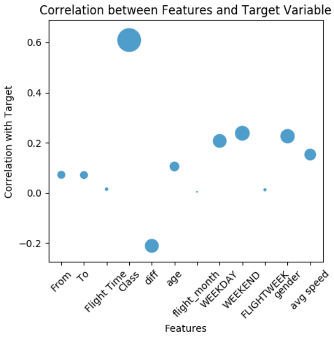

# JPMC QUANT CHALLENGE

## Barrier Option Pricing Model
A barrier option is a type of derivative where the payoff depends on whether or not the underlying asset has reached or exceeded a predetermined price. A barrier option can be a **knock-out**, meaning it expires worthless if the underlying exceeds a certain price or be a **knock-in**, meaning it has no value until the underlying reaches a certain price. 

  

Barrier options are also considered a type of **path-dependent option** as the payoff is based on the underlying asset's price path. Using this fact, we can use Monte Carlo Simulation to simulate different paths for stock prices and eventually using it to get the option's price. Here, I have used two different methods to model the stock price simulation:

### 1. Geometric Brownian Motion Model (Question 1)

It assumes that the logarithm of the asset's price follows a random walk with drift and volatility, and it's often used to simulate stock prices over time. The below equation is present in it's differential form, to simulate the prices we need to first discretize it. The resultant monte carlo simulation follows a **normal distribution** with it's mean same as that of the initial stock price (S0) and standard deviation is equal to the volatility.

  

For this question, we need to find the option price of a **down and out put** option, i.e., the option becomes worthless once the price of the asset goes below the barrier price. The monte carlo simulation below shows 10000 simulations and a barrier price level. To calculate the option's payoff, we average the payoff obtained from each simulation and discount the price to the present value.

  

### 2. Cox-Ingersoll-Ross Model (Question 2)

CIR Model is a stochastic process used to model key financial variables in finance. It is also a mean reverting square root process where on long term the stochastic value will tend to converge towards the mean. The process is governed by the following stochastic differential equation:

  

For this question, we need to find the option price of a up and out put option, i.e., the option becomes worthless once the price of the asset goes beyond a certain barrier price. The monte carlo simulation shows 10000 simulations and a barrier price level. To calculate the option's payoff, we average the payoff obtained from each simulation and discount the price to the present value.

  

## Air Ticket Pricing Model (Question 3)

Optimal timing for airline ticket purchasing from the consumer’s perspective is challenging principally because buyers have insufficient information for reasoning about future price movements. Here, we have been provided with the training dataset, of which some entries are shown below:

  

The most challenging part of the problem was feature engineering, in order to compute the best possible future prices I tried constructing new features from the existing features to make the model more robust. Clarification regarding some not so obvious features:
1. From, To - There are 6 cities in the dataset, a dictionary is created where each city corresponds to a number
2. Flight Time - the hour part of HH:MM is considered as a feature
3. Class - There are two classes of ticket - economy and business. The average ratio of price of these two types of ticket is 1:3.6
4. diff - It is the difference in time from when the ticket was bought and when the flight is scheduled.
5. WEEKEND - Anytime after 17:00, Friday till 00:00 Monday is considered a WEEKEND
The modified features after feature engineering is shown below:

I have used **XGBRegressor** to predict the future prices and obtained a score of 0.9999 on the training dataset and the predicted values are present in the corresponding folder. The below images shows the correlations between the features and the target variable based on the training data & the second plot is a partial dependence plot between the age of the customer and the price they are willing to pay (just an interesting observation).

  
  

